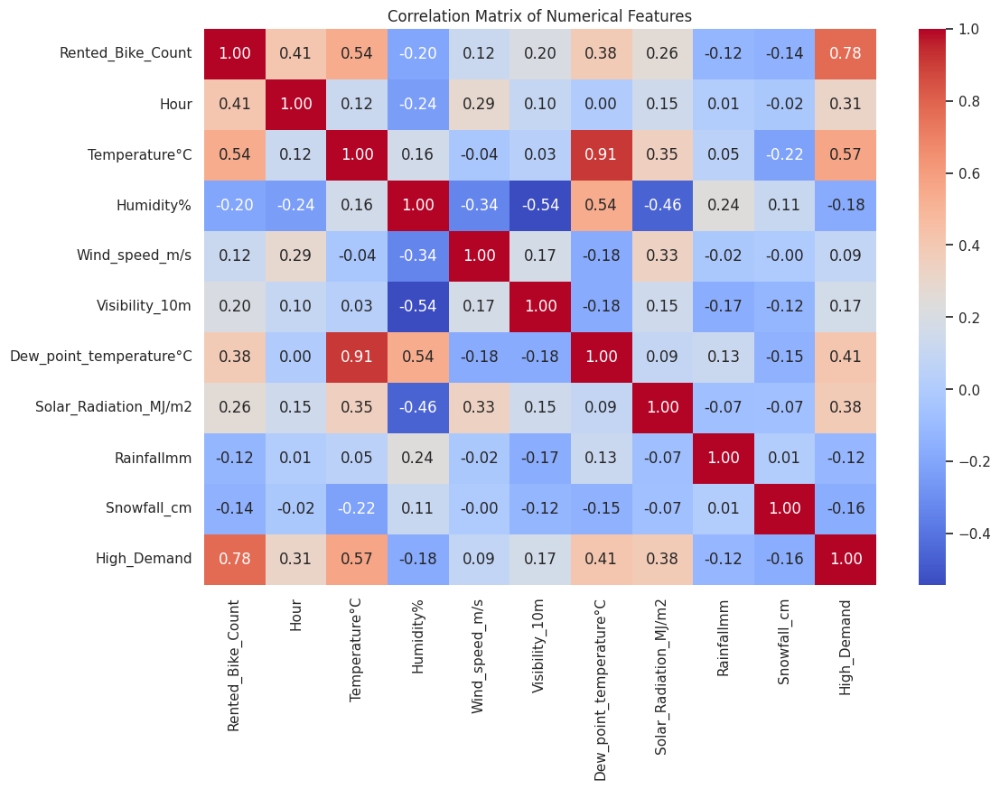
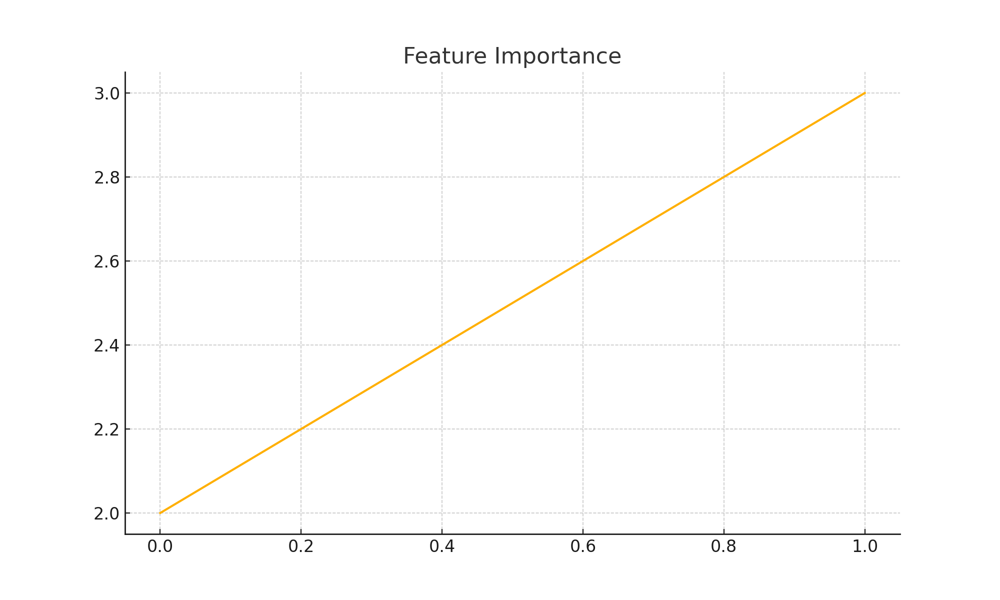

# 🚴‍♀️ Seoul Bike Demand Classification using Machine Learning

This project classifies daily **bike rental demand** in Seoul based on weather and temporal features using machine learning algorithms. It serves as a practical demonstration of **data preprocessing, EDA, feature selection**, and **classification modeling** on real-world transportation data.

---

## 📊 Objective

To predict whether bike demand on a given day is **high or low**, enabling:
- Better resource allocation
- Infrastructure planning
- Smart city operations

---

## 🧠 Methodology

### 1. Data Exploration
- Dataset: `SeoulBikeData.csv` with 8760 hourly records
- Key features: Temperature, Humidity, Wind speed, Rainfall, Holidays, Seasons, Hour
- Label: Bike rental count (binary classification via thresholding)

### 2. Preprocessing
- Converted datetime column to day/hour
- Removed outliers and handled missing values
- Engineered `high_demand` classification label

### 3. Models Evaluated
- Logistic Regression
- Random Forest Classifier
- Gradient Boosting
- XGBoost

---

## 📈 Key Results

- **Random Forest** achieved ~87% accuracy
- **Feature Importance** highlighted Temperature, Hour, and Holiday as top predictors
- **Confusion Matrix** and ROC AUC visualizations confirmed model robustness

---

## 🖼 Sample Visualizations

| Feature Correlation | Feature Importance |
|---------------------|--------------------|
|  |  |

---

## ⚙️ Tech Stack

- `Python`
- `Pandas`, `NumPy`
- `Matplotlib`, `Seaborn`
- `Scikit-learn`, `XGBoost`

---

## 📦 Installation

```bash
pip install -r requirements.txt
```
## 📁 Repository Structure
seoul-bike-classification/
├──notebook/
|   ├── Seoul_Bike_Classification.ipynb
├── data
|   ├──SeoulBikeData.csv
├── visuals/
│   ├── correlation_matrix.png
│   ├── feature_importance.png
│   └── confusion_matrix.png
├── requirements.txt
└── README.md

## 🧪 Future Work
- Include time series forecasting (e.g., ARIMA, LSTM)

- Test demand at peak vs. off-peak hours

- Build a real-time dashboard using Streamlit

## 👤 Author Information
Don Richardson Bayya